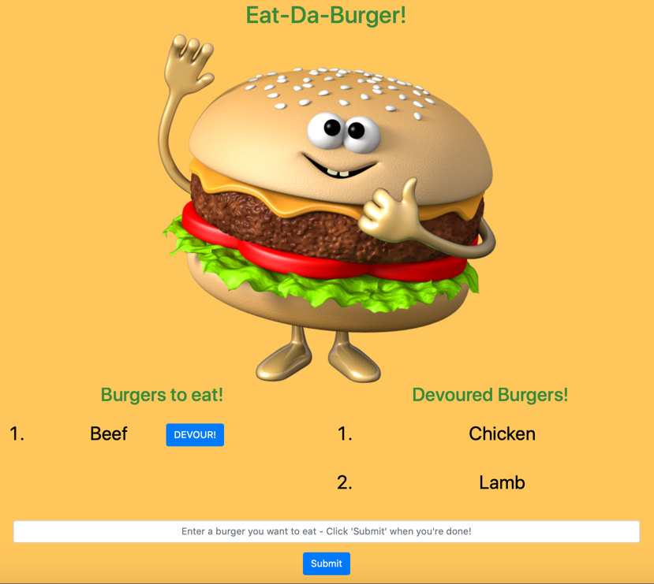

      

# Welcome to Burger Logger 👋

## Description

📚 An `MVC inspired application` that allows users to enter the name of the burger they want to devour. This app is built with `MySQL`, `Node`, `Express`, `Handlebars` and `ORM` which follows the `MVC design pattern`.

## Table of Contents 🗂

* [Description](#Description)
* [Installation](#Installation)
* [Usage](#Usage)
* [License](#License)
* [Version](#Version)
* [Contributing](#Contributing)
* [Tests](#Tests)
* [Questions](#Questions)

## Installation

⚙️ use `Clone with HTTPS` and run `git clone + the HTTPS link` to install locally. Run `npm i`.

## Usage

🚨 run `mysql -u root -p` in the terminal => then, run `source schema.sql` & `source seeds.sql` => then, `quit` mysql => then, run `npm start` and visit the `localhost` link

View live demo <a href="https://enigmatic-cove-34274.herokuapp.com">here</a>

## License

🖋 

This app is not using a license

## Version

℣ 

## Contributing

👩‍💻 create a fork and submit a PR for review

## Tests

🧪 n/a

## Questions

❓ Feel free to create an issue for review

🌍 https://github.com/darren-behan

📧 me at darrenbehan@hotmail.com
